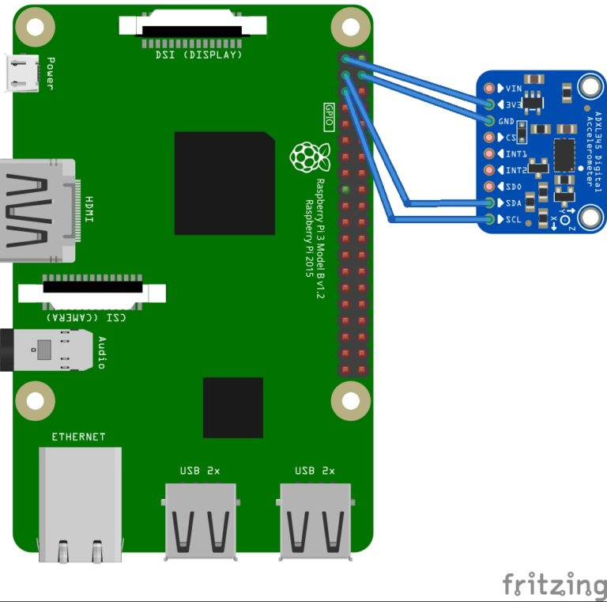

# CS370_TP
CS370 term project, tested on a Raspberry Pi 5 with an ADXL345 accelerometer. Follow for more updates...

## Team Members
- Spencer Beer
- Elaine Smith

## Hardware Initialization
Wire your Raspberry Pi to the ADXL345 as shown in the following diagram:



## Software Initialization

To initialize the project, run the following command:
```
sudo apt upgrade && sudo apt update -y
```
Then clone the repository:
```
git clone https://github.com/ersmith01/CS370_TP
```

To install the adafruit blinka library, run the following commands according to the [adafruit guide](https://learn.adafruit.com/circuitpython-on-raspberrypi-linux/installing-circuitpython-on-raspberry-pi):

To ensure the required python packages are installed, run the following command:
```
pip3 install -r requirements.txt
```

## Running the Project
```bash
python3 app.py
```
To automatically run the project on boot, first modify the `screaming-roomba.service` file to point to the correct path of the `app.py` file. Then, copy the file to the `/etc/systemd/system` directory and enable the service:
```bash
sudo cp screaming-roomba.service /etc/systemd/system/
```

> Before moving any further, you might have modify your /etc/asound.conf file to include the output of your sound card. This article [here](https://raspberrypi.stackexchange.com/questions/95193/setting-up-config-for-alsa-at-etc-asound-conf) explains more. This can be done by running the following command:
```bash
sudo nano /etc/asound.conf
```
Then, add the following lines to the file:
```
defaults.pcm.card 1
defaults.ctl.card 1
```

Now, reload the daemon, enable the service, and start the Screamba service:
```bash
sudo systemctl daemon-reload
sudo systemctl enable screaming-roomba
sudo systemctl start screaming-roomba
```

To check the status of the Screamba:
```bash
sudo systemctl status screaming-roomba
```
To stop the Screamba:
```bash
sudo systemctl stop screaming-roomba
```